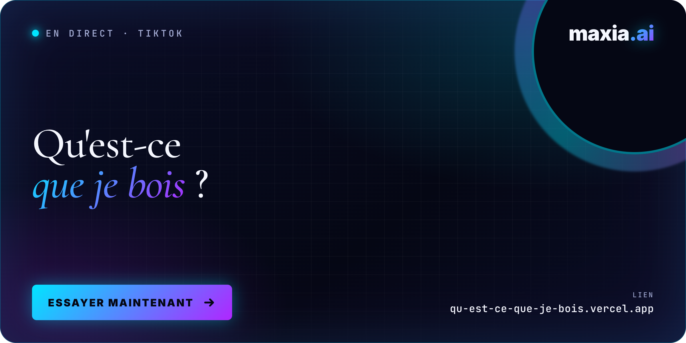

<div align="center">

<a href="https://qu-est-ce-que-je-bois.vercel.app">
  
</a>

# Qu'est-ce que je bois&nbsp;?

**Recherche de cocktails par ingrédients · React 19 + Vite 8**
<br />
*Conçu, codé et déployé en direct dans une vidéo TikTok avec Claude Code.*

<br />

[](https://qu-est-ce-que-je-bois.vercel.app)

[](https://claude.com/claude-code)
[](https://vitejs.dev)
[](https://react.dev)
[](https://www.tiktok.com/@maxia.ai)
[](#licence)

</div>

---

## Le projet

> *Glissez ce que vous avez sur l'étagère, derrière le bar ou au fond du frigo —
> on trouvera quelque chose à boire.*

Une mono-page qui prend les ingrédients que vous tapez en français
(*« gin, citron vert, menthe »*) et liste les cocktails à préparer
avec exactement ces ingrédients, **classés par nombre d'ingrédients en
commun**. Chaque vignette ouvre la recette détaillée : doses, étapes,
type de verre, alcoolisé ou non.

Côté UX, l'esprit est celui d'un index éditorial — typographie serif,
palette chaude OKLCH, mise en page papier. Le résultat tient en
un seul écran, sans navigation, sans inscription.

---

## La pile

| Couche | Outil |
|---|---|
| **Pair-programming** | [Claude Code](https://claude.com/claude-code) |
| **Build & runtime** | Vite 8 + React 19 (JavaScript, pas de TypeScript) |
| **Données** | [TheCocktailDB](https://www.thecocktaildb.com) (clé publique v1) |
| **Hébergement** | [Vercel](https://vercel.com) — déploiement statique en ~10 s |
| **Typographies** | Cormorant Garamond · Manrope · JetBrains Mono · Inter (pour la signature maxia.ai) |
| **Couleurs** | Système OKLCH perceptuellement uniforme |

Aucune clé API requise, aucun back-end, aucun store global — du React pur.

---

## Architecture

```
src/
├── main.jsx              ── entrée Vite
├── App.jsx               ── state global + logique de matching
├── styles.css            ── design system (tokens OKLCH, layout, animations)
├── components/
│   ├── Header.jsx        ── brand-mark + signature « maxia.ai » néon cyan→violet
│   ├── Hero.jsx          ── « Qu'est-ce que je bois ce soir ? »
│   ├── IngredientBar.jsx ── input tags + chips suggestions + actions
│   ├── Card.jsx          ── vignette résultat (thumb, n°, match count)
│   ├── CocktailModal.jsx ── détail recette (ingrédients, doses, étapes)
│   └── Credits.jsx       ── « Coulisses · Conçu en direct » + CTA TikTok
└── lib/
    ├── api.js            ── fetch wrappers TheCocktailDB
    ├── translations.js   ── FR→EN (ingrédients, verres, catégories)
    └── utils.js          ── normalize, splitSteps, formatDose
```

### Logique de matching

Pour chaque ingrédient saisi, on tape `filter.php?i=<ingredient>` sur
TheCocktailDB. On fusionne les listes, on compte combien d'ingrédients
saisis chaque cocktail contient, et on trie : **plus de match commun en
haut, ex æquo départagés par ordre alphabétique**.

---

## Lancer en local

```bash
npm install
npm run dev      # http://localhost:5173 — hot reload
npm run build    # bundle de production dans dist/
npm run preview  # tester le bundle localement
```

Pas de variables d'environnement, pas de secrets. `clone` & `npm install`
suffisent.

---

## Déploiement

Hébergé sur Vercel avec auto-détection du framework Vite — aucun
`vercel.json` n'est requis. Pour redéployer manuellement :

```bash
npx vercel deploy --prod
```

Si tu connectes le repo à Vercel via l'intégration Git, chaque `git
push` sur `main` déclenche un déploiement automatique en ~10 s.

---

## Crédits

- **Design original** — prototype exporté depuis [claude.ai/design](https://claude.ai/design)
- **Recettes** — [TheCocktailDB](https://www.thecocktaildb.com)
- **Voix off, montage TikTok et tout le reste** — [@maxia.ai](https://www.tiktok.com/@maxia.ai)

> *À consommer avec modération.*

---

## Licence

MIT. Fork librement, mais pas de boisson à l'œil.

<br />

<div align="center">

[](https://www.tiktok.com/@maxia.ai)

*Construit en direct, en une seule prise, avec Claude Code.*

</div>
